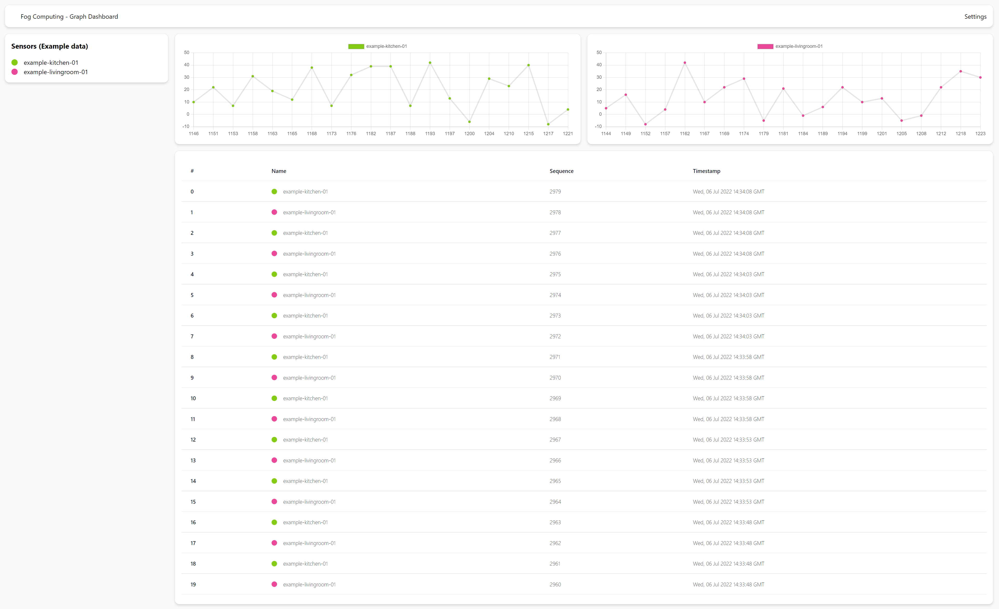

<h1 align="center">Prototype Assignment</h1>
<h2 align="center">Fog Computing - TU Berlin</h2>
<h3 align="center">Summer Semester 2022</h3>
<h3 align="center">License: <a 
    href="https://github.com/fog-computing-prototype/fog-computing-prototype/blob/main/LICENSE"
    target="_blank">MIT</a>
</h3>

---

<p align="center">
  
</p>

---

## Table of contents

<!-- TOC -->

- [Table of contents](#table-of-contents)
- [Description](#description)
  - [Requirements](#requirements)
  - [Further notes](#further-notes)
- [Architecture](#architecture)
- [Dashboard website](#dashboard-website)
- [Technology stack](#technology-stack)
- [Documentation](#documentation)
- [Start locally](#start-locally)
  - [Environment variables](#environment-variables)
  - [All: Local + Cloud + Dashboard](#all-local--cloud--dashboard)
    - [Docker compose](#docker-compose)
  - [Local](#local)
    - [Docker compose](#docker-compose-1)
    - [Manually](#manually)
  - [Cloud](#cloud)
    - [Docker compose](#docker-compose-2)
    - [Manually](#manually-1)
    - [Addresses](#addresses)
  - [Frontend](#frontend)
    - [Docker compose](#docker-compose-3)
    - [Manually](#manually-2)
    - [Addresses](#addresses-1)
- [Setup GCP](#setup-gcp)
  - [Create resources on GCP](#create-resources-on-gcp)
  - [Credentials/Variables](#credentialsvariables)
- [Define sensors](#define-sensors)
- [API docs](#api-docs)
  - [Endpoints](#endpoints)

<!-- /TOC -->

---

## Description 

The task was to design and implement an application that can deal with various different challenges related to fog computing.

### Requirements

1. The application must comprise a local component that runs on a local machine, and a component running in the Cloud, e.g., on GCE.
2. The local component must collect and make use of (simulated) environmental information. For this purpose, a minimum of two virtual sensors should be designed and used that continuously generate realistic data.
3. Data has to be transmitted regularly (multiple times a minute) between the local component and the Cloud component in both directions.
4. When disconnected and/or crashed, the local and Cloud component have to keep working while preserving data for later transmission. Upon reconnection, the queued data needs to be delivered.

### Further notes

- The application can be implemented in any standard programming language
-  It is not allowed to use any Cloud services or frameworks that take care of resolving fog-specific challenges, e.g., regarding reliable message delivery 
   -  (messaging libraries such as ZeroMQ are fine). 
- The goal of the prototype is to build a fog application and to manually implement the reliable delivery of messages.

## Architecture

<p align="center">
  <a 
    href="https://raw.githubusercontent.com/fog-computing-prototype/fog-computing-prototype/main/docs/architecture/architecture.svg"
    target="_blank">
    
  </a>
</p>

Diagram was created with [diagrams.net](https://app.diagrams.net/).

## Dashboard website

Website: [Dashboard](https://fog-computing-prototype.github.io/)

<p align="center">
<table>
	<tr>
		<th>Main page</th>
		<th>Settings</th>
 	</tr>
 	<tr>
    <td>
      <a 
        href="https://raw.githubusercontent.com/fog-computing-prototype/fog-computing-prototype/main/docs/images/dashboard-01-home.png"
        target="_blank">
        
      </a>
    </td>
    <td>
      <a 
        href="https://raw.githubusercontent.com/fog-computing-prototype/fog-computing-prototype/main/docs/images/dashboard-02-settings.png"
        target="_blank">
        
      </a>
    </td>
 	</tr>
</table>
</p>

> In the [Settings](https://fog-computing-prototype.github.io/settings) you can set the URL for the API.  
> You can only use `https` endpoints! Default value is: `http://127.0.0.1:8000`.

Because the website hosted on [GitHub pages](https://fog-computing-prototype.github.io/) uses `https`, only https API endpoints can be called there.

Because our default scripts use only `http` to connect to the GCP instance, use the manual way or start the [`docker-compose`](./dashboard/docker-compose.yaml) file in `./dashboard/docker-compose.yaml`. See: [section: Frontend - Docker compose](#docker-compose-2). Then you can reach the GCP compute engine over `http`.

---

## Technology stack

- Local app:
  - [Python](https://www.python.org/)
  - [Pydantic](https://pydantic-docs.helpmanual.io/)
  - [SQLAlchemy](https://www.sqlalchemy.org/)
  - [ZeroMQ](https://zeromq.org/) ([PyZMQ](https://pypi.org/project/pyzmq/))
  - [black](https://github.com/psf/black)
  - [SQLite](https://www.sqlite.org/)
  - [Poetry](https://python-poetry.org/)
  - [Docker](https://www.docker.com/)
  - [Docker-compose](https://docs.docker.com/compose/)
- Dashboard website:
  - [Vue.js](https://vuejs.org/)
  - [Vite](https://vitejs.dev/)
  - [TypeScript](https://www.typescriptlang.org/)
  - [Tailwind CSS](https://tailwindcss.com/)
  - [vue-chartjs](https://vue-chartjs.org/)
  - [Axios](https://axios-http.com/)
  - [pnpm](https://pnpm.io/)
  - [Docker](https://www.docker.com/)
  - [Docker-compose](https://docs.docker.com/compose/)
- Cloud app:
  - [Python](https://www.python.org/)
  - [Pydantic](https://pydantic-docs.helpmanual.io/)
  - [SQLAlchemy](https://www.sqlalchemy.org/)
  - [ZeroMQ](https://zeromq.org/) ([PyZMQ](https://pypi.org/project/pyzmq/))
  - [black](https://github.com/psf/black)
  - [SQLite](https://www.sqlite.org/)
  - [Poetry](https://python-poetry.org/)
  - [Docker](https://www.docker.com/)
  - [Docker-compose](https://docs.docker.com/compose/)
  - [FastAPI](https://fastapi.tiangolo.com/)
  - [Uvicorn](https://www.uvicorn.org/)
  - Shell script
  - [Google Cloud Platform (GCP)](https://cloud.google.com/)
  - [Google Compute Engine (GCE)](https://cloud.google.com/compute/)

---

## Documentation

- Documentation PDF:
  - https://github.com/fog-computing-prototype/fog-computing-prototype/blob/main/docs/Documentation.pdf
  - [Download PDF](https://github.com/fog-computing-prototype/fog-computing-prototype/raw/main/docs/Documentation.pdf)
- Demonstration Video:
  - [Download video](https://github.com/fog-computing-prototype/fog-computing-prototype/blob/main/docs/videos/Demonstration-video.mp4?raw=true)

---

## Start locally

### Environment variables

| Component | Name                          | Default                | Description                                    |
| --------- | ----------------------------- | ---------------------- | ---------------------------------------------- |
| Local     | `LOCAL_CLOUD_ENDPOINT_URL`    | `tcp://localhost:5556` | The cloud component ZeroMQ endpoint url        |
|           | `LOCAL_LISTENER_ENDPOINT_URL` | `tcp://*:5557`         | The local component ZeroMQ endpoint to bind to |
| Cloud     | `CLOUD_LOCAL_ENDPOINT_URL`    | `tcp://localhost:5557` | The local component ZeroMQ endpoint url        |
|           | `CLOUD_LISTENER_ENDPOINT_URL` | `tcp://*:5556`         | The cloud component ZeroMQ endpoint to bind to |

### All: Local + Cloud + Dashboard

#### Docker compose

Use `-d` to start it in the background.

Run: 
```bash
# Run service
docker compose up -d 
```

| Description                          | URL                                                                                      |
| ------------------------------------ | ---------------------------------------------------------------------------------------- |
| Dashboard address                    | [`http://localhost/`](http://localhost/)                                                 |
| Cloud API                            | [`http://localhost:8000`](http://localhost:8000)                                         |
| Cloud API docs                       | [`http://localhost:8000/docs`](http://localhost:8000/docs)                               |
| Cloud API: GET sensor data           | [`http://localhost:8000/sensor-data`](http://localhost:8000/sensor-data)                 |
| Cloud API: GET sensor data (ordered) | [`http://localhost:8000/sensor-data/ordered`](http://localhost:8000/sensor-data/ordered) |

---

### Local

Go into the: `local/` folder.

#### Docker compose

Use `-d` to start it in the background.

Run: 
```bash
# Run service
docker compose up -d 
```

#### Manually

Run: 
```bash
# Install dependencies
poetry install

# Run service
poetry run python -m local.main
```

---

### Cloud

Go into the: `cloud/` folder.

#### Docker compose

Use `-d` to start it in the background.

Run: 
```bash
# Run service
docker compose up -d 
```

#### Manually

Run: 
```bash
# Install dependencies
poetry install

# Run service
poetry run uvicorn cloud.main:app
```

#### Addresses

| Description                          | URL                                                                                      |
| ------------------------------------ | ---------------------------------------------------------------------------------------- |
| Cloud API                            | [`http://localhost:8000`](http://localhost:8000)                                         |
| Cloud API docs                       | [`http://localhost:8000/docs`](http://localhost:8000/docs)                               |
| Cloud API docs                       | [`http://localhost:8000/docs`](http://localhost:8000/docs)                               |
| Cloud API: GET sensor data           | [`http://localhost:8000/sensor-data`](http://localhost:8000/sensor-data)                 |
| Cloud API: GET sensor data (ordered) | [`http://localhost:8000/sensor-data/ordered`](http://localhost:8000/sensor-data/ordered) |

---

### Frontend

Go into the: `dashboard/` folder.

#### Docker compose

Use `-d` to start it in the background.

Run: 
```bash
# Run service
docker compose up -d 
```

#### Manually

Run: 
```bash
# Install dependencies
pnpm install

# Run service
pnpm run dev
```

#### Addresses

| Description       | URL                                      |
| ----------------- | ---------------------------------------- |
| Dashboard address | [`http://localhost/`](http://localhost/) |

---

## Setup GCP

### Create resources on GCP

1. Follow the steps in section [Credentials/Variables](#credentialsvariables) to setup the required variables.
2. Edit the variables (or use the given values) in  [`gcp-00-settings.sh`](./gcp-00-settings.sh).
3. Setup the resources on GCP (GCP project, GCP compute engine, firewall settings):
   - Execute script [`gcp-01-initial-setup.sh`](./gcp-01-initial-setup.sh) 
   - To execute it use: `sh ./gcp-01-initial-setup.sh`
4. Setup Python and Poetry on the previously created GCP compute instance:
   - Execute script: [`gcp-02-install-python.sh`](./gcp-02-install-python.sh)
5. Upload the cloud files to the GCP compute instance:
   - Execute script: [`gcp-03-upload-files.sh`](./gcp-03-upload-files.sh)
6. Start the app in the cloud:
   - Execute script: [`gcp-04-start-cloud-app.sh`](./gcp-04-start-cloud-app.sh)

- You can use [`gcp-all.sh`](./gcp-all.sh) to execute all scripts above at once.
- You can use [`gcp-instance-01-start.sh`](./gcp-instance-01-start.sh) to start the GCP compute instance and [`gcp-instance-02-stop.sh`](./gcp-instance-02-stop.sh) to stop it.

### Credentials/Variables

Copy template file `template.credentials.sh`, rename it to `credentials.sh` and fill out the variables.

| Variable name      | Description                  | Example                 |
| :----------------- | :--------------------------- | :---------------------- |
| `CREDENTIALS_PATH` | Path to SSH folder           | `/home/<username>/.ssh` |
| `CREDENTIAL_NAME`  | Name of the SSH key          | `fogcomputing`          |
| `SSH_PW`           | Password for the SSH key     |                         |
| `COMMENT_SSH`      | Comment for the SSH key      | `fog-computing`         |
| `PROJECT_ID`       | Project ID on GCP            | `fogcomputing`          |
| `PROJECT_NAME`     | Project name on GCP          |                         |
| `USER_NAME`        | Username of the GCP instance |                         |


## Define sensors

You can define multiple sensors in the [`/local/sensors.yaml`](./local/sensors.yaml) file.
You can choose between two types of sensors `temperature_sensors` and `humidity_sensors`.

Below is an example of such a file:

```yaml
temperature_sensors:
  # Recommended name schema: <sensor_type>-<location>-<number>
  - name: temperature-kitchen-01
    interval: 5 # in seconds

  - name: temperature-livingroom-01
    interval: 5

humidity_sensors:
  - name: humidity-bedroom-01
    interval: 5
```

## API docs

<p align="center">
  <a 
    href="https://raw.githubusercontent.com/fog-computing-prototype/fog-computing-prototype/main/docs/api/API-docs.png"
    title="Open API docs in fullscreen"
    target="_blank">
    
  </a>
</p>

- [Open API docs in fullscreen](https://raw.githubusercontent.com/fog-computing-prototype/fog-computing-prototype/main/docs/api/API-docs.png)

### Endpoints

| Description                          | HTTP Verb | CRUD | Endpoint               |
| ------------------------------------ | --------- | ---- | ---------------------- |
| Cloud API docs                       | GET       | Read | `/docs`                |
| Cloud API: GET sensor data           | GET       | Read | `/sensor-data`         |
| Cloud API: GET sensor data (ordered) | GET       | Read | `/sensor-data/ordered` |
